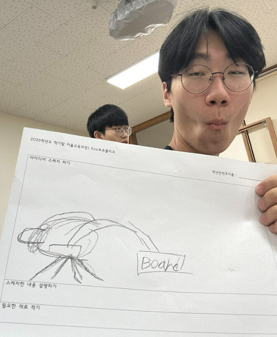
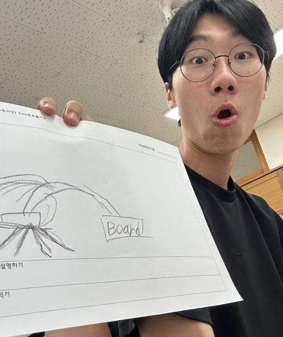
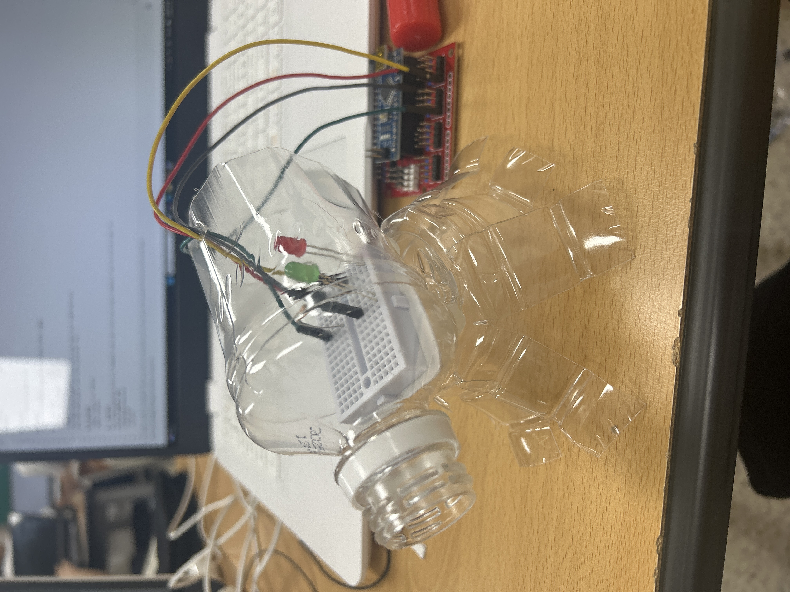

# 🌱 에코아트 프로젝트: [작품명]

## 📖 프로젝트 개요
- **제작자**: [park jun hoo]
- **제작일**: [2025 7/16]
- **소개**
> 현대 사회에서 환경오염,특히 플라스틱 쓰레기문제는 매우 심각한 사회의 이슈이고 분해되는데 수백년이 걸리는데 버리는대신 창의력을 활용해 재사용의 가치를 높이자는 의미에서 제작했다.

## 📦 사용 재료
- 아두이노, 온도센서, LED, 브레드보드
- 페트병, 가위,테이프 

## 🔧 제작 과정 
### 1단계: 아이디어 스케치

- 아이디어 설명
- 예상 완성도

### 2단계: 완성품

## 💭 제작 후기
### 잘된 점
-  내가 원하는 디자인으로 작품을 에코 환경과 연관지어서 자유롭게 표현했다

### 아쉬운 점
- 아두이노가 무드등으로만 사용하는것이 아쉽다 

### 개선할 점
- 사용자의 맞게 여려 다양성으로 활용 할수있게 하기 에코아트 프로젝트: [작품명]

## 📦 사용 재료
- 아두이노, 온도센서, LED, 브레드보드
- 페트병, 가위,테이프 

## 🔧 제작 과정
우리가 주변에서 쉽게생각하고 가볍게 여기는 제활용품들이 관심을 조금만 가진다면 이렇게 친환경적인 제퐐용품으로 사옹이 가능 하다는것을 나타낼수 있다 
### 1단계: 아이디어 스케치

- 아이디어 설명
- 예상 완성도

### 2단계: 완성품

## 💭 제작 후기
### 잘된 점
- 내가 원하는 디자인으로 재활용품이 새롭게 태어났다

### 아쉬운 점
- 아두이노가 무드등으로만 사용되는것아 아쉽다

### 개선할 점
- 사용자의 맞게 여려 다양성으로 활용 할수있게 하기

### 내가 이미 알고 있었던 것
- usb 케이블을 연결하면 원하는 코드를 입력해 사용이 가능하다 

### 새롭게 배운게 된 것
여러 고급 기술을 요구 할줄알았는데 막상 배우니 초등학생들도 쉽게 따라하며 교육 받을수 있을거 같

### 더 알고 싶은 것
- 와이파이혹은 블루투스로도 연결하여 사용할수있을까?

## 🌍 환경적 의미
-  기술로 환경문제에 접
- 단순히 ‘재활용하자’고 말하는 것보다, 직접 작품을 만들면서 “자원을 아껴야 한다”는 인식을 자연스럽게 배움.
- 쓰레기로 버려지는 보통의 물건들이 이 활동으로 새롭게 태어남

## 📚 참고 자료
- [환경 관련 웹사이트](링크)
- [참고한 에코아트 작품](링크)

#시흥고 #아두이노 #교육 #컴퓨터 #장곡전이준
---

> 이 프로젝트는 환경 보호와 창의적 사고를 위한 교육 목적으로 제작되었습니다.
